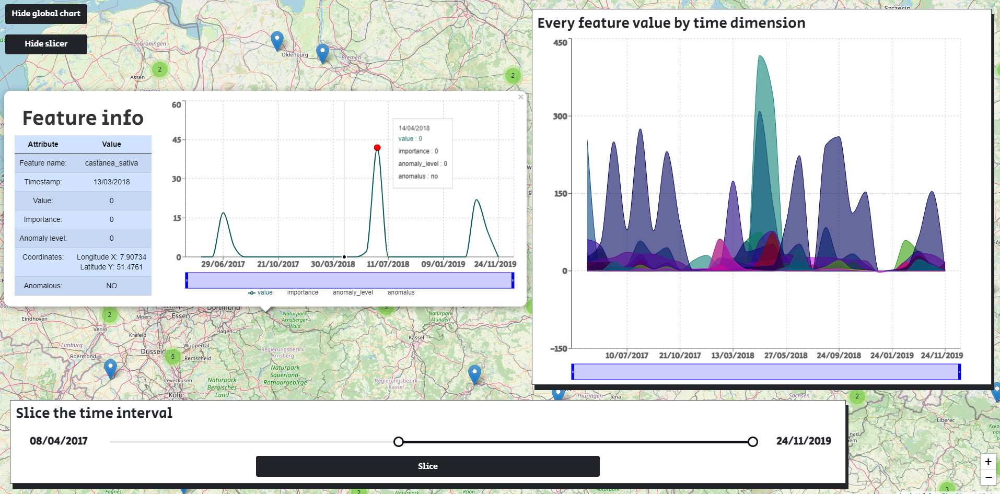

# UI-anomaly-detection #

**This project is part of traineeship of Teodors Lisovenko at University of Bari Aldo Moro.**



## *The summary of the project:* ##

:information_source: Development of a simple UI capable to show the stream of data from an endpoint as a graph in a Cartesian plane where the x-axis represents the temporal dimension and the y-axis represents the variable under analysis currently. This is necessary to support the task of anomaly detection from geo-referenced sensor data. Here is the example of the dataset: [See the example.](data-example.json)

### Snippet of the incoming or uploaded data:
```json
{
  "results": [
    {
      "timestamp": "25/06/2016",
      "ranking": [
        {
          "feature": "castanea_sativa",
          "coordinates": {
            "x": "16.871871",
            "y": "41.117143"
          },
          "value": 41.0,
          "importance": 0.38,
          "anomaly_level": 1.0
        },
        {
          "feature": "artemisia",
          "coordinates": {
            "x": "16.871871",
            "y": "41.117143"
          },
          "value": 0.0,
          "importance": 0.0,
          "anomaly_level": 0.0
        }
      ],
      "anomaly": "true"
    }
  ]
}

```

### General requirements: ###

- Visualize the geospatial data, more precisely the "features" and have a possibility to plot them on the web map.
- Each feature, which is represented as a point or a mark in the map, must be clickable as an opening pop-up / modal / or some other type of window, which will contain all the specific information about that feature.. 
- There must be a place for a dynamic chart in a Cartesian plane which is showing the data (like "value", "anomaly_level", etc.) in each feature basing on the timestamp. 
- There must be support for two types of data input:
    -As a static JSON file, which user can locally upload and after it see its visualization.
    - In the absence of the JSON file - as a URL endpoint. In this case, the visualization must fetch the data from the endpoint and plot it in similar manner. 

### Used technology and libaries: ###

* The project base is [Node.js](https://nodejs.org/en/) version 14.17.1.
* Developed in [React](https://reactjs.org/) version 17.0.2.
The main libraries in use are:
* [Recharts](https://recharts.org/en-US//)
* [React Leaflet](https://react-leaflet.js.org/)
## Milestone1 (August 20th): ##

> What must be done: Overall design of the UI and visualization of static file upload scenario.
### *To-do's...* ###

- [x] Prepare the README.MD and learn few days about React (especially the routing and how to transfer data from one component to another).
- [x] Start with the "Hello screen". Create the area for "drag-and-drop" and provide overall upload functionality.
- [x] Use Recharts and Leflet libraries to provide the basis of visualization.

## Milestone2 (August 26th): ##

> What must be done: Visualization by endpoint.
### *To-do's...* ###

- [x] Try out the Netlify service provider to host a separate API project, which will host a possibility for fetching the anomaly data.
## Milestone3 (September 1th): ##

> What must be done: Optimization and refactoring.
### *To-do's...* ###

- [x] Do the refactoring of code, fix bugs and optimize what can be optimized.   
